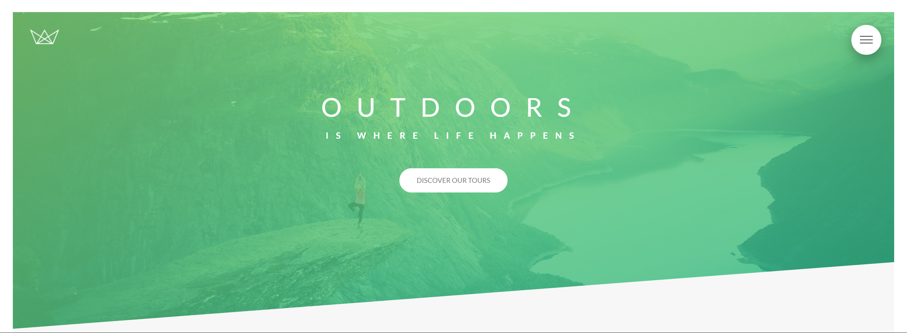

# Natours-project

Landpage desenvolvida no curso Advanced CSS and SASS.

<!--ts-->
   * [Sobre](#Sobre)
   * [Instalação](#instalacao)
   * [Paginas](#paginas) 
   * [Pré-requisitos](#pré-requisitos) 
   * [Tecnologias](#tecnologias)
   * [Curso](#curso)
   * [Autor](#autor)

<!--te-->

### Instalação

 - [x] Git Clone.
 - [x] npm install.
 - [x] npm run start. 

### Seções

- [x] Header
- [x] Features
- [x] Tours
- [x] Stories
- [x] Book
- [x] Footer

### Pré-requisitos

- [x] Computador
- [x] Browser Atualizado

### 🔧 Tecnologias

As seguintes ferramentas foram usadas na construção do projeto:

- [HTML](https://developer.mozilla.org/pt-BR/docs/Web/HTML)
- [CSS](https://developer.mozilla.org/pt-BR/docs/Web/HTML)
- [SASS](https://sass-lang.com/)

### 📱 Demo

- <b>Versão Desktop</b>
  

- <b>Versão Mobile</b>

### 💻 Pattern

- [7-1 Pattern Architecture](https://www.learnhowtoprogram.com/user-interfaces/building-layouts-preprocessors/7-1-sass-architecture)

## 🔗 Curso

- [Advanced CSS and SASS](https://www.udemy.com/course/advanced-css-and-sass/)

### 😎 Autor
---

<a href="https://blog.rocketseat.com.br/author/thiago/">
 
  
 <b>Pedro Henrique</b></a> <a href="https://blog.rocketseat.com.br/author/thiago//" title="Rocketseat">🚀</a>

Feito por Pedro Henrique 👋🏽 Adiciona lá :D

